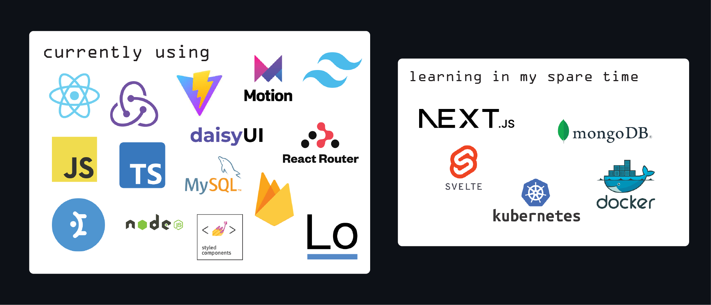

<h1 align="center">I'm Marcin 👨🏼‍💻</h1>
<h3 align="center">Student and novice web developer</h3>

- 🙋‍♂️ I’m currently learning new technologies and looking for my place in web development
- 🎓 I'm learning: <b>React, Redux, TypeScript</b>
- 🗓️ I want to learn: <b>Docker, Kubernetes, Next.js, MongoDB</b>
- 👷🏼‍♂️ I'm Working on [INFinity](https://github.com/marcinwolder/INFinity)
- 🏫 I'm studying <i><u>Artificial Intelligence and Machine Learning</u></i> at <b>AGH</b> - Cracow
  

---

  

